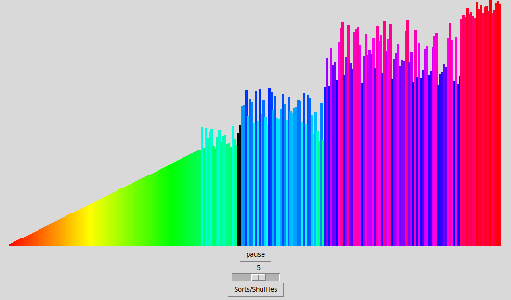
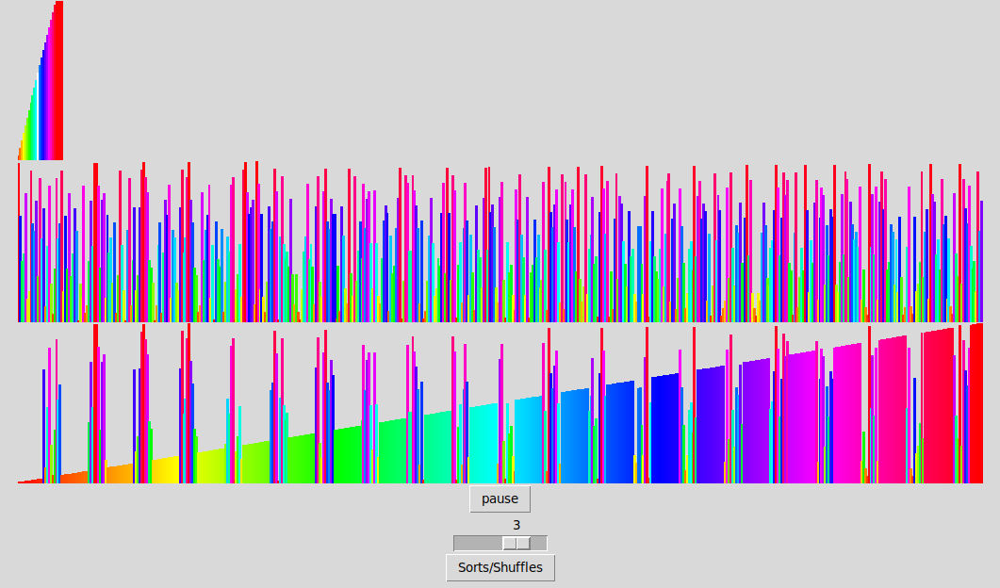
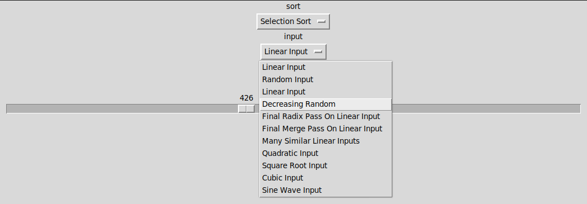
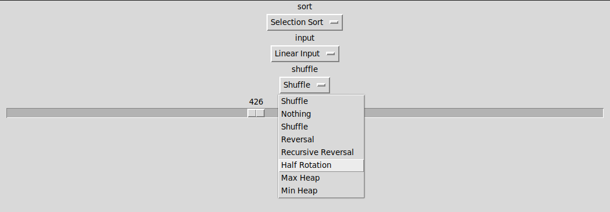

# TkinterSortVisualizer
A sorting algorithm visualizer built with lots of different options for sorting algorithms, inputs and speeds.

WARNING!!

PLAYING THIS VISUALIZER CAN CAUSE SEIZURES, OVERSTIMULATION, HEADACHES, ETC, AND IS VERY OVERWHELMING TO THE SENSES. IT CONTAINS COLORED BARS MOVING AT 60+FPS, AND UNCOMFORTABLE SOUNDS.



## Motivation
Around 2022, I developed a special interest in sorting algorithms. I watched many YouTube videos that visualized sorting algorithms, and used pitch to 'audify' each number in the arrays being sorted. I saw lots of different sorting algorithm visualizers and visualization videos, all with their own features that I liked and disliked. 

I wanted to create a sorting algorithm visualizer myself, as a challenge. And I wanted it to be the perfect balance of all the visualizers I had seen in the internet. That's why I included many options for algorithms, inputs and speeds. This program aims at providing lots of flexibility  and interactivity with the algorithms, even if it breaks!
## Features


- Bar graph display for the array to sort (with colors!)
- Audio representations of numbers (A corresponding pitch plays when a number is written or read)
- Choosing the size of the array




- Being able to choose different combinations of inputs, shuffles, and sorts!


- Different bases, options and configurations to try on sorts!
- Pause/Play
- Changing the speed of the algorithms (This is great to get an intuition on the Big O of the different algorithms, and gives you a sense of scale on how these algorithms make progress!)
- Labeled pointers (Arrows pointing at positions in arrays, to show what the algorithms are keeping track of)

Currently, these are all the available sorting algorithms:
- Bubble Sort
- Optimized Bubble Sort
- Cocktail Shaker Sort
- Optimized Cocktail Shaker Sort
- Odd-Even Sort
- Insertion Sort
- Baiai Sort
- Comb Sort
- Exchange Sort
- Selection Sort
- Max Heap Sort
- Min Heap Sort
- Quick Sort (LL pointers)
- Merge Sort
- Merge Sort In-Place,
- Radix LSD Sort
- Radix LSD Sort In-Place
- Count Sort
- GravitySort
- Kuvina's Square Root Sort
- Batcher's Bitonic Sort
- IR Bitonic Sort
- Iterative Bitonic Sort
- Pairwise Sorting Network
- Odd Even Merge Sort
- IR Odd Even Merge Sort
- Iterative Odd Even Merge Sort
- Time Sort
- Slow Sort
- Bogo Sort
## Future Features and Progress
Recently, I added the ability to display labeled pointers to the arrays as arrows, so the users can see what positions the algorithms are keeping track of! Right now, only Square Root Sort uses these pointers, but I hope to use these more in the future!

I also am planning to:
- Add parallel sorting for sorting networks, and with the ability to run them either iteratively or in parallel
- Fix audio bugs and make it sound better
- Add different sound waves/sounds in general
- Add different theming options to make things easier to see, or for preference
- Show steps more explicitly and easier to understand for beginners
- Display messages and statuses of the steps the algorithms are making, for debugging and learning
- Display statistics of different operations, and even the time it really takes for algorithms to finish, so the users get a better sense of scale for the algorithms, and their different operations
- Make better use of the verification step of the program
- Correct the inaccurate ways the statistics are currently being counted
- Add more, and more, and more, AND MORE SORTING ALGORITHMS!!!!!!!!!!

## Contribution
Currently, this project isn't complete. It still lacks a lot of UI features, and the sound isn't as great as envisioned. I plan to keep adding more and more sorting algorithms, which I prioritize over the GUI. If you want to contribute, I'd love to see your ideas!
## Installation
First, make sure you have Python 3 installed. I recommend Python3.9 or higher.

Clone the repository:
```
$ git clone git@github.com:GABETROLL/TkinterSortVisualizer.git
$ cd TkinterSortVisualizer/
```
Install the required Python modules:
```
$ pip3 install -r requirements.txt
```
(or replace ``pip3`` with ``pip`` for Windows)
## Usage
Running the program:
```
$ python3 main.py
```
(or replace ``python3`` with ``python`` for Windows)
